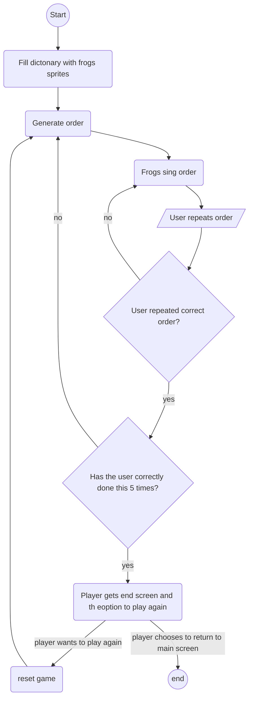

# Proef Examen Repo

Voor de proef examen opdracht moest er een mobiele game gemaakt worden die Augmented Reality gameplay elementen integreren in een wandelroute. De klant (Berbas) is een Bed & breakfast gelegen in de Veluwe, om de wandeling voor kinderen dragelijker te maken. Voor de game hebben we gekozen voor een concept waarbij we de gps locatie gebruiken om aan de gebruiker te laten zien waar ze zich bevinden op de route en om minigames te starten wanneer ze in de buurt zijn. Wanneer ze die minigames halen krijgen ze een bos dier als prijs.

# Geproduceerde Game Onderdelen

Student, Teun:

 - [SingingFrogs minigame](https://github.com/T3rabyte/Proef-Examen/tree/origin/minigame%232_memory/proef%20proeve/Assets/src/Singing%20Frogs "SingingForgs minigame")
 - [Memory minigame](https://github.com/T3rabyte/Proef-Examen/tree/origin/minigame%232_memory/proef%20proeve/Assets/src/memory "SingingForgs minigame")
 - [Zoek de dieren minigame](https://github.com/T3rabyte/Proef-Examen/tree/origin/minigame%232_memory/proef%20proeve/Assets/src/Tracks "Zoek de dieren")
 - [GPS](https://github.com/T3rabyte/Proef-Examen/tree/origin/minigame%232_memory/proef%20proeve/Assets/src/gps "GPS")

Student, Jaimy:

 - [GPS Rail Systeem](https://github.com/T3rabyte/Proef-Examen/tree/origin/feature%233_GPS/proef%20proeve/Assets/src/Rail)
 - [GPS](https://github.com/T3rabyte/Proef-Examen/tree/origin/minigame%232_memory/proef%20proeve/Assets/src/gps "GPS")
 - UI

# SingingFrogs minigame by Teun

Voor deze minigame waren er 3 kikkers, de kikkers zingen in een random volgorde, die de gebruiker dan na klikt. dit gebeurd in opbouwende volgorde met eerst 1 kikker t/m uiteindelijk 5 kikkers. wanneer de gebruiker de volgorde fout heeft herhalen de kikkers zich en kan de gebruiker het opnieuw proberen. Wanneer de game af is kan de gebruiker het spel opnieuw spelen (met een nieuwe volgorde) of terug naar de map.

# GPS Rail Systeem by Jaimy
De manier hoe ik de GPS Rail Systeem heb aangepakt was als volgt. De spelers GPS locatie checkt voor de 2 dichtstbijzijnde waypoints en probeert dan een projectie van de speler op die lijn te casten. Deze projectie is wat de Speler ziet als hun locatie. Ook houd dit systeem in de gaten dat 2 waypoints niet hetzelfde zijn. Ook kan de speler in de tegen gestelde richting gaan zonder problemen.

